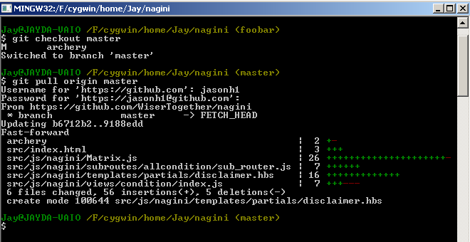
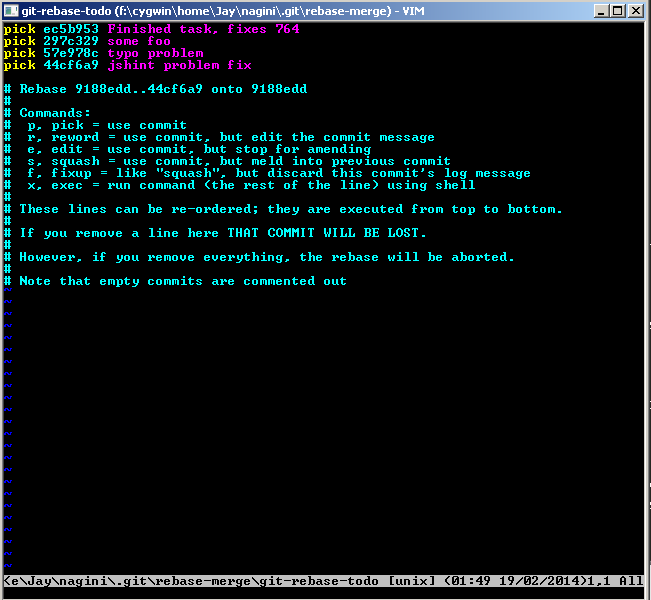
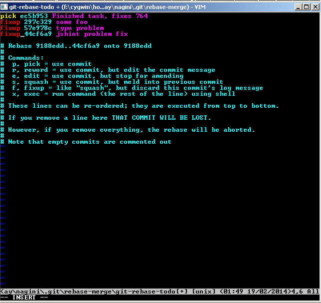
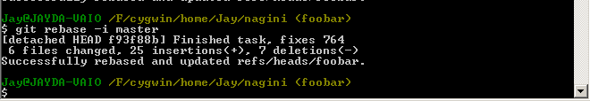
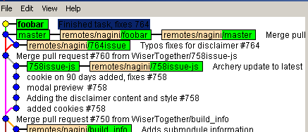

== GitHub Develop-Squash-Commit Workflow

This is an alternative workflow to allow easier merging for PR merge masters.

The follow steps outline how to do this:

We assume origin is the remote repo you are working on

open a git command window and first do a:

git checkout master

git pull origin master

You may need to update the archery sub-module folder.

To do this you can delete the archery folder in your project

then do a:

git submodule update

This will re-point and checkout archery with the current latest version.

Now finally you should rebase to master and apply your work on top of it
and squash-commit any commit messages which you don't want to belong.

git checkout <feature-branch>

git rebase -i master

It is recommended to do your first commit as the commit message you want
to use. In our example we use fixup to discard the commit message but squash
the changes into the previous commit.  Hence the reason why the first commit
message should be the sensible one you want to use

You should exit the editor and execute the rebase by doing :wq (in windows)

You should see a screen like this if everything is successful.

Finally you can double check the branch history has squashed or fixed all commits
into one by visualisaing the branch history you should see just one commit line
like this:

